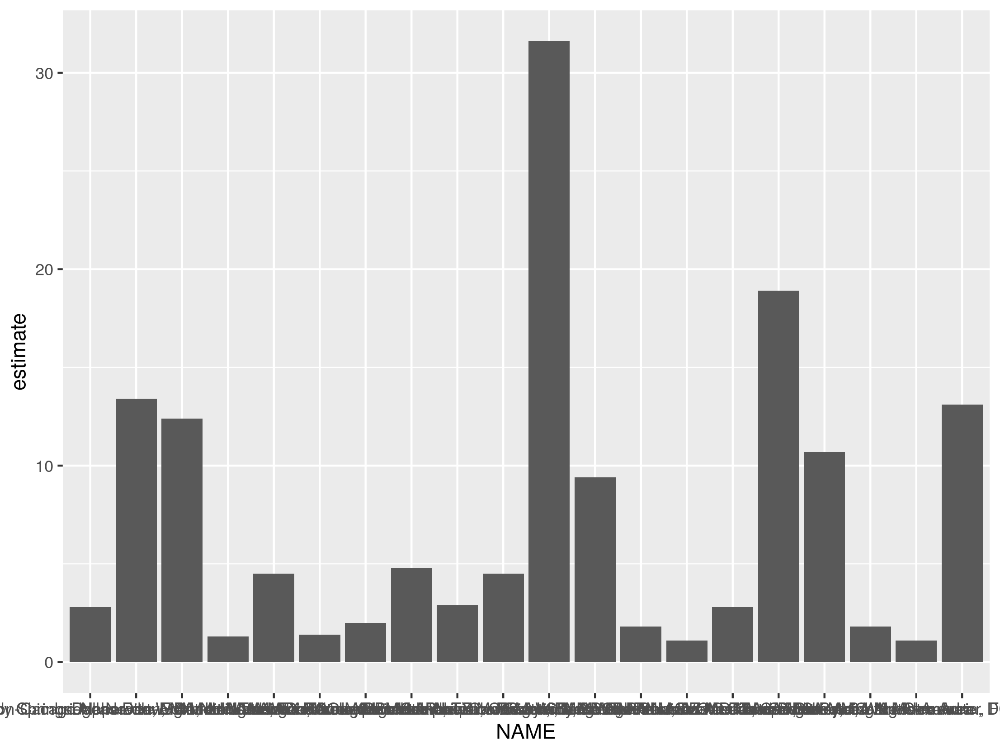
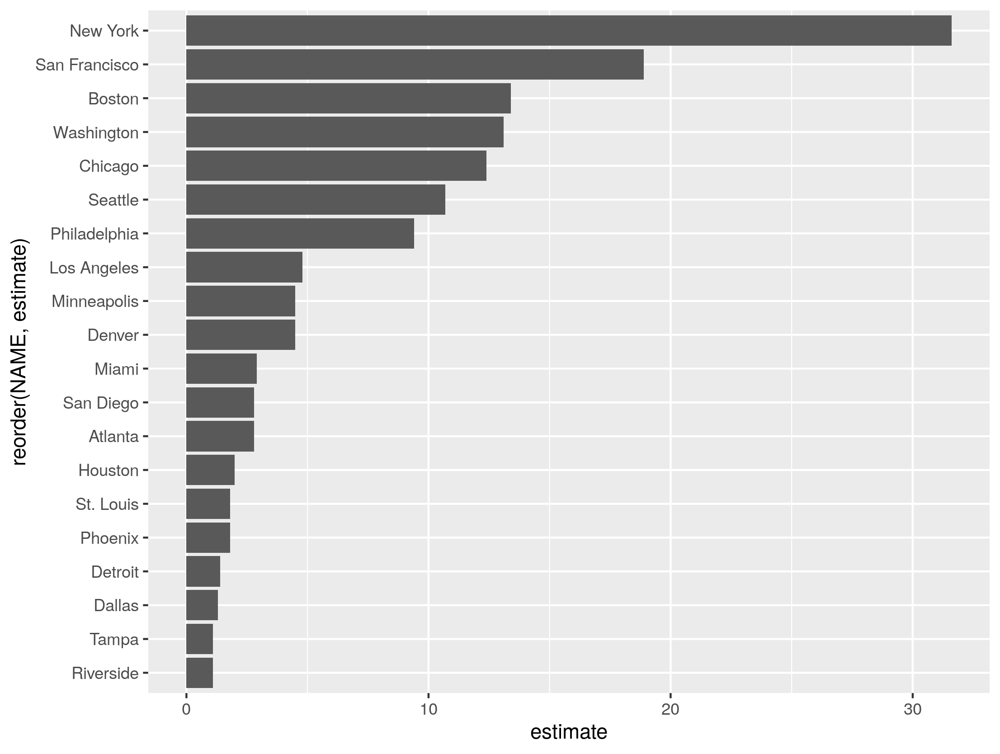
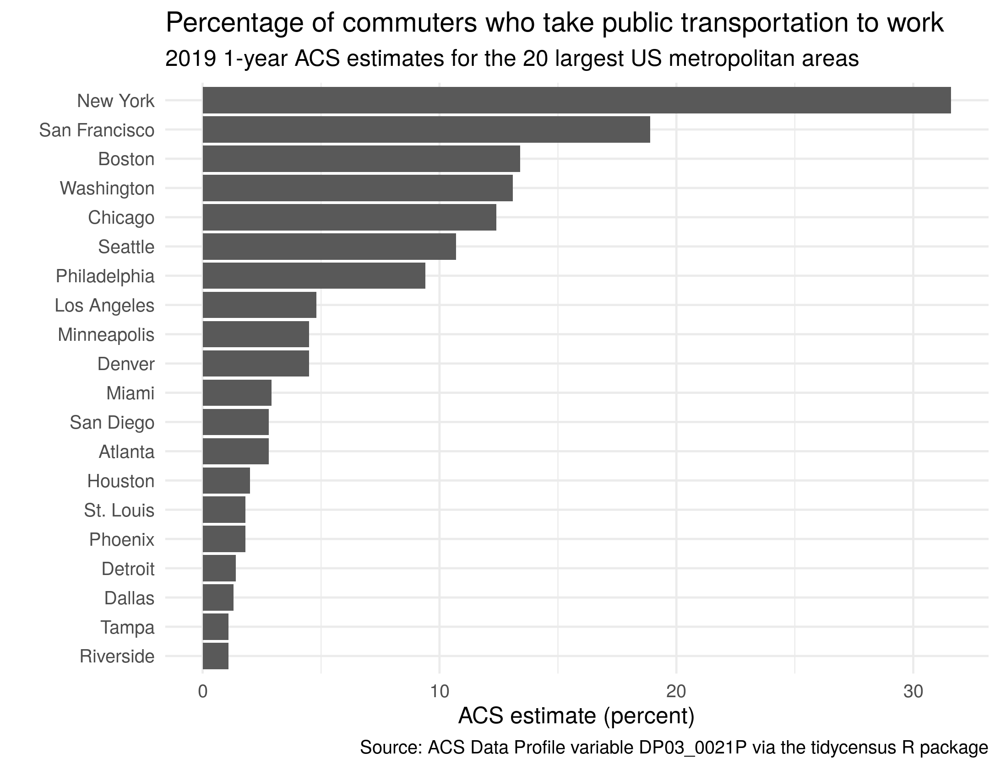
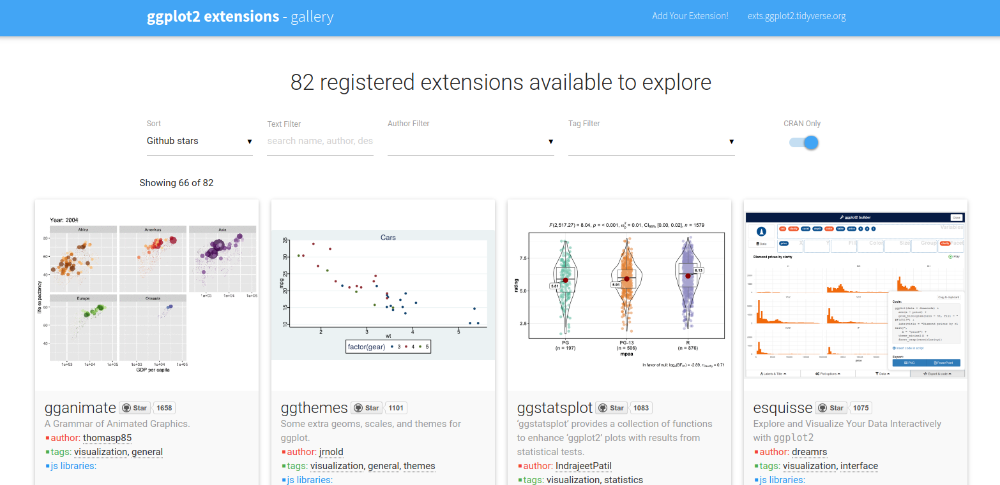

```{r setup, include=FALSE}
options(htmltools.dir.version = FALSE)
options(tigris_use_cache = TRUE)
library(tidycensus)

knitr::opts_chunk$set(message = FALSE, warning = FALSE, fig.width = 8)
```

```{r xaringan-themer, include=FALSE, warning=FALSE}
library(xaringanthemer)

style_xaringan(
  title_slide_background_color = "#035004",
  text_color = "black",
  header_color = "#035004",
  inverse_background_color = "#035004",
  text_font_family = "Gotham Narrow",
  header_font_family = "Helvetica",
  header_font_weight = "bold",
  link_color = "#1a730f",
  code_inline_color = "#035004"
)
```

## About me

* Associate Professor of Geography at TCU 

* Spatial data science researcher and consultant

* R package developer: tidycensus, tigris, mapboxapi

* Book coming this year: _Analyzing the US Census with R_
  - These workshops are a sneak preview of the book's content!

---

## SSDAN workshop series

* Today: an introduction to analyzing US Census data with tidycensus

* Next Thursday (March 11): spatial analysis and mapping in R

* Thursday, March 25: working with US Census microdata (PUMS) with R and tidycensus

---

## Today's agenda

* Hour 1: Getting started with tidycensus

* Hour 2: Wrangling Census data with tidyverse tools

* Hour 3: Visualizing US Census data

---
class: middle, center, inverse

## Part 1: Getting started with tidycensus

---

## Typical Census data workflows


---

## The Census API

* [The US Census __A__pplication __P__rogramming __Interface__ (API)](https://www.census.gov/data/developers/data-sets.html) allows developers to access Census data resources programmatically

* R packages to interact with the APIs: censusapi, acs

* Other languages: cenpy (Python), citySDK (JavaScript)

---

## tidycensus

* R interface to the Decennial Census, American Community Survey, Population Estimates Program, and Public Use Microdata Series APIs

* Key features: 
  - Wrangles Census data internally to return tidyverse-ready format (or traditional wide format if requested);
  
  - Automatically downloads and merges Census geometries to data and returns simple features objects (next week's workshop!); 
  
  - Includes tools for handling margins of error in the ACS and working with survey weights in the ACS PUMS;
  
  - States and counties can be requested by name (no more looking up FIPS codes!)
  
---

## Development of tidycensus

* Mid-2010s: I started accumulating R scripts that did the same thing over and over (download Census data from the API, transform to tidy format, join to spatial data)

* (Very) early implementation: [acs14lite](https://rpubs.com/walkerke/acs14lite)

* 2017: first release of tidycensus following the implementation of a "tidy spatial data model" in the sf package

* 2020: Matt Herman joins as co-author; support for ACS microdata (PUMS) in tidycensus

---

## Getting started with tidycensus

* To get started, install the packages you'll need for today's workshop

* If you are using the RStudio Cloud environment, these packages are already installed for you

```{r install-packages, eval = FALSE}
install.packages(c("tidycensus", "tidyverse", "plotly"))
```

---

## Your Census API key

* To use tidycensus, you will need a Census API key.  Visit https://api.census.gov/data/key_signup.html to request a key, then activate the key from the link in your email.  

* Once activated, use the `census_api_key()` function to set your key as an environment variable

```{r api-key, eval = FALSE}
library(tidycensus)

census_api_key("YOUR KEY GOES HERE", install = TRUE)
```

---
class: middle, center, inverse

## Basic usage of tidycensus

---

## tidycensus: the basics

* The two main functions in tidycensus are `get_decennial()` for the 2000 and 2010 decennial Censuses and `get_acs()` for the American Community Survey

* The two required arguments are `geography` and `variables` for the functions to work; the default `year` in `get_decennial()` is `2010`

```{r decennial}
pop10 <- get_decennial(
  geography = "state",
  variables = "P001001"
)
```

---

* Decennial Census data are returned with four columns: `GEOID`, `NAME`, `variable`, and `value`

```{r view-decennial}
pop10
```

---

## The American Community Survey

* The American Community Survey (ACS) is an annual survey of approximately 3 million households, and asks more detailed questions than the decennial Census

* The default dataset in `get_acs()` is the 2015-2019 5-year dataset; the 1-year dataset is also available for geographies of population 65,000 and greater

```{r acs}
income_15to19 <- get_acs(
  geography = "state",
  variables = "B19013_001"
)
```

---

* The output of `get_acs()` includes the `GEOID`, `NAME`, and `variable` columns along with the ACS `estimate` and `moe`, which is the margin of error around that estimate at a 90 percent confidence level

```{r view-acs}
income_15to19
```

---

* One-year ACS data can be requested with the argument `survey = "acs1"`

```{r acs1}
income_19 <- get_acs(
  geography = "state",
  variables = "B19013_001",
  survey = "acs1"
)

income_19
```
---

## Requesting tables of variables

* The `table` parameter can be used to obtain all related variables in a "table" at once

```{r acs-table}
age_table <- get_acs(
  geography = "state", 
  table = "B01001"
)
```

---

```{r view-table}
age_table
```

---
class: middle, center, inverse

## Understanding geography and variables in tidycensus

---

## US Census Geography


.footnote[Source: [US Census Bureau](https://www2.census.gov/geo/pdfs/reference/geodiagram.pdf)]

---

## Geography in tidycensus

* Information on available geographies, and how to specify them, can be found [in the tidycensus documentation](https://walker-data.com/tidycensus/articles/basic-usage.html#geography-in-tidycensus-1)


---

## Querying by state

```{r query-by-state}
wi_income <- get_acs(
  geography = "county", 
  variables = "B19013_001", 
  state = "WI",
  year = 2019
)

wi_income
```

---

## Querying by state and county

```{r query-by-county}
dane_income <- get_acs(
  geography = "tract", 
  variables = "B19013_001", 
  state = "WI", 
  county = "Dane"
)

dane_income
```
---

## Searching for variables

* To search for variables, use the `load_variables()` function along with a year and dataset

* The `View()` function in RStudio allows for interactive browsing and filtering

```{r search-variables, eval = FALSE}
vars <- load_variables(2019, "acs5")

View(vars)

```

---


---
class: middle, center, inverse

## Data structure in tidycensus

---

## "Tidy" or long-form data

```{r tidy-data}
hhinc <- get_acs(
  geography = "state", 
  table = "B19001", 
  survey = "acs1"
)

hhinc
```

---

## "Wide" data 

```{r wide-data}
hhinc_wide <- get_acs(
  geography = "state", 
  table = "B19001", 
  survey = "acs1", 
  output = "wide"
)

hhinc_wide
```

---

## Using named vectors of variables

```{r named-variables}
ga_wide <- get_acs(
  geography = "county",
  state = "GA",
  variables = c(medinc = "B19013_001",
                medage = "B01002_001"),
  output = "wide"
)

ga_wide
```

---

## Part 1 exercises

1. Review the available geographies in tidycensus from the tidycensus documentation.  Acquire data on median age (variable B01002_001) for a geography we have not yet used.  

2. Use the `load_variables()` function to find a variable that interests you that we haven't used yet.  Use `get_acs()` to fetch data from the 2015-2019 ACS for counties in the state where you live.  

---
class: middle, center, inverse

## Part 2: Wrangling Census data with tidyverse tools

---

## The tidyverse

```{r tidyverse}
library(tidyverse)

tidyverse_logo()
```

* The [tidyverse](https://tidyverse.tidyverse.org/index.html): an integrated set of packages developed primarily by Hadley Wickham and the RStudio team

---

## tidycensus and the tidyverse

* Census data are commonly used in _wide_ format, with categories spread across the columns

* tidyverse tools work better with [data that are in "tidy", or _long_ format](https://vita.had.co.nz/papers/tidy-data.pdf); this format is returned by tidycensus by default

* Goal: return data "ready to go" for use with tidyverse tools

---
class: middle, center, inverse

## Exploring Census data with tidyverse tools

---

## Finding the largest values

* dplyr's `arrange()` function sorts data based on values in one or more columns, and `filter()` helps you query data based on column values

* Example: what are the youngest and oldest counties in the United States by median age?

```{r median-age}
library(tidycensus)
library(tidyverse)

median_age <- get_acs(
  geography = "county",
  variables = "B01002_001"
)

```

---

```{r sort-ascending}
arrange(median_age, estimate)

```

---

```{r sort-descending}
arrange(median_age, desc(estimate))
```

---

## What are the counties with a median age above 50?

```{r filter-above-50}
above50 <- filter(median_age, estimate >= 50)

above50
```
---

## Using summary variables

* Many decennial Census and ACS variables are organized in tables in which the first variable represents a _summary variable_, or denominator for the others

* The parameter `summary_var` can be used to generate a new column in long-form data for a requested denominator, which works well for normalizing estimates

---

## Using summary variables

```{r summary-variable}
race_vars <- c(
  White = "B03002_003",
  Black = "B03002_004",
  Native = "B03002_005",
  Asian = "B03002_006",
  HIPI = "B03002_007",
  Hispanic = "B03002_012"
)

az_race <- get_acs(
  geography = "county",
  state = "AZ",
  variables = race_vars,
  summary_var = "B03002_001"
)
```

---

```{r view-summary-variable}
az_race
```

---

## Normalizing columns with `mutate()`

* dplyr's `mutate()` function is used to calculate new columns in your data; the `select()` column can keep or drop columns by name

* In a tidyverse workflow, these steps are commonly linked using the pipe operator (`%>%`) from the magrittr package

```{r mutate-and-select}
az_race_percent <- az_race %>%
  mutate(percent = 100 * (estimate / summary_est)) %>%
  select(NAME, variable, percent)
```


---

```{r view-percent}
az_race_percent
```

---
class: middle, center, inverse

## Group-wise Census data analysis

---

## Group-wise Census data analysis

* The `group_by()` and `summarize()` functions in dplyr are used to implement the split-apply-combine method of data analysis

* The default "tidy" format returned by tidycensus is designed to work well with group-wise Census data analysis workflows

---

## What is the largest group by county?

```{r largest-group}
largest_group <- az_race_percent %>%
  group_by(NAME) %>%
  filter(percent == max(percent))
```

---

```{r view-largest-group}
largest_group
```

---

## What are the median percentages by group?

```{r median-by-group}
az_race_percent %>%
  group_by(variable) %>%
  summarize(median_pct = median(percent))
```

---
class: middle, center, inverse

## Working with margins of error in tidycensus

---

## Margins of error in the ACS

* As the American Community Survey is a _survey_, its estimates are subject to a _margin of error_, or MOE

* By default, MOEs are returned at a 90 percent confidence level; e.g., "we are 90 percent sure that the true value falls within a range defined by the estimate plus or minus the margin of error"

---

## Margins of error in tidycensus

* tidycensus always returns the margin of error for ACS estimates when applicable.  

* By default, margins of error are contained in the `moe` column; in wide-form data, MOEs are found in columns that end with `M`

* The `moe_level` parameter controls the confidence level of the MOE; choose `90` (the default), `95`, or `99`

---

## Example: population over age 65 by sex

```{r moe-example}
vars <- paste0("B01001_0", c(20:25, 44:49))

salt_lake <- get_acs(
  geography = "tract",
  variables = vars,
  state = "Utah",
  county = "Salt Lake",
  year = 2019
)

example_tract <- salt_lake %>%
  filter(GEOID == "49035100100")
```

---

```{r view-moe}
example_tract %>% select(-NAME)
```
---

## Margin of error functions in tidycensus

* tidycensus includes helper functions for calculating derives margins of error based on Census-supplied formulas.  These functions include `moe_sum()`, `moe_product()`, `moe_ratio()`, and `moe_prop()`

Example: 

```{r moe-prop}
moe_prop(25, 100, 5, 3)
```

---

## Calculating group-wise margins of error

```{r summarize-moe}
salt_lake_grouped <- salt_lake %>%
  mutate(sex = if_else(str_sub(variable, start = -2) < "26",
                       "Male", 
                       "Female")) %>%
  group_by(GEOID, sex) %>%
  summarize(sum_est = sum(estimate), 
            sum_moe = moe_sum(moe, estimate))

```

---

```{r view-summarize-moe}
salt_lake_grouped
```

---

## Part 2 exercises

* The ACS Data Profile includes a number of pre-computed percentages which can reduce your data wrangling time.  The variable in the 2015-2019 ACS for "percent of the population age 25 and up with a bachelor's degree" is `DP02_0068P`.  For a state of your choosing, use this variable to determine: 
  - The county with the highest percentage in the state;
  
  - The county with the lowest percentage in the state;
  
  - The median value for counties in your chosen state

---
class: middle, center, inverse

## Part 3: Visualizing US Census data

---

## Visualizing US Census data

* tidycensus is designed with ggplot2-based visualization in mind, the core framework for data visualization in the tidyverse

* ggplot2 along with its extensions can be used for everything from simple graphics to complex interactive plots

---

## Comparing ACS estimates

* Example: the percentage of commuters taking public transit to work in the 20 most populous US metropolitan areas (CBSAs)

```{r get-metro-data}
library(tidycensus)
library(tidyverse)

metros <-
  get_acs(
    geography = "cbsa",
    variables = "DP03_0021P",
    summary_var = "B01003_001",
    survey = "acs1"
  ) %>%
  filter(min_rank(desc(summary_est)) < 21)
```

---

```{r view-metro-data}
glimpse(metros)
```
---

## Exploring data with visualization

```{r first-plot, eval = FALSE}
p <- ggplot(metros, aes(x = NAME, y = estimate)) + 
  geom_col()

p
```

---



---

## Improving your plot

```{r better-plot, eval = FALSE}
p <- metros %>%
  mutate(NAME = str_remove(NAME, "-.*$")) %>%
  mutate(NAME = str_remove(NAME, ",.*$")) %>%
  ggplot(aes(y = reorder(NAME, estimate), x = estimate)) + 
  geom_col()


p
```

---



---

## Improving your plot

```{r best-plot, eval = FALSE}
p <- p +  
  theme_minimal() + 
  labs(title = "Percentage of commuters who take public transportation to work", 
       subtitle = "2019 1-year ACS estimates for the 20 largest US metropolitan areas", 
       y = "", 
       x = "ACS estimate (percent)", 
       caption = "Source: ACS Data Profile variable DP03_0021P via the tidycensus R package")
  

p

```


---



---
class: middle, center, inverse

## Visualizing margins of error in the ACS

---

## Comparing estimates across groups

* Given variable population sizes of enumeration units like counties, margins of error around estimates can vary significantly

* Example: median household income for counties in Maine

```{r maine-data}
maine_income <- get_acs(
  state = "Maine",
  geography = "county",
  variables = c(hhincome = "B19013_001")
) %>%
  mutate(NAME = str_remove(NAME, " County, Maine"))

```

---

```{r view-maine-data}
maine_income %>% arrange(desc(moe))

```

---

## Visualizing margins of error

```{r moe-plot, eval = FALSE}
ggplot(maine_income, aes(x = estimate, y = reorder(NAME, estimate))) + 
  geom_errorbarh(aes(xmin = estimate - moe, xmax = estimate + moe)) + 
  geom_point(size = 3, color = "darkgreen") + 
  labs(title = "Median household income", 
       subtitle = "Counties in Maine", 
       x = "2015-2019 ACS estimate", 
       y = "") + 
  scale_x_continuous(labels = scales::dollar)
```

---


---
class: middle, center, inverse

## Age and sex structure with population pyramids

---

## Population Estimates Program (PEP) in tidycensus

* The `get_estimates()` function fetches data from the [Population Estimates Program (PEP) APIs](https://www.census.gov/data/developers/data-sets/popest-popproj/popest.html)

* Data are organized by `product` which include `"population"`, `"components"` (births/deaths/migration), `"housing"`, and `"characteristics"`

---

## Getting age & sex estimates

```{r utah-data}
utah <- get_estimates(
  geography = "state",
  state = "UT",
  product = "characteristics",
  breakdown = c("SEX", "AGEGROUP"),
  breakdown_labels = TRUE,
  year = 2019
) 

utah
```


---

## A first population pyramid

```{r prep-utah-data}
utah_filtered <- filter(utah, str_detect(AGEGROUP, "^Age"), 
                  SEX != "Both sexes") %>%
  mutate(value = ifelse(SEX == "Male", -value, value))

utah_filtered
```

---

## A first population pyramid

```{r first-pyramid, eval = FALSE}
ggplot(utah_filtered, aes(x = value, y = AGEGROUP, fill = SEX)) + 
  geom_col()
```

---


---

## Cleaning up the population pyramid

```{r formatted-pyramid, eval = FALSE}
utah_pyramid <- ggplot(utah_filtered, aes(x = value, y = AGEGROUP, fill = SEX)) + 
  geom_col(width = 0.95, alpha = 0.75) + 
  theme_minimal(base_family = "Verdana") + 
  scale_x_continuous(labels = function(y) paste0(abs(y / 1000), "k")) + 
  scale_y_discrete(labels = function(x) gsub("Age | years", "", x)) + 
  scale_fill_manual(values = c("darkred", "navy")) + 
  labs(x = "", 
       y = "2019 Census Bureau population estimate", 
       title = "Population structure in Utah", 
       fill = "", 
       caption = "Data source: US Census Bureau population estimates & tidycensus R package")

utah_pyramid
```

---


---

## Interactive visualization with plotly

```{r plotly, eval = FALSE}
library(plotly)

ggplotly(utah_pyramid)
```

---

<iframe src="img/utah_pyramid.html" frameborder="0" seamless scrolling="no" height="550" width="800"></iframe>

---
class: middle, center, inverse

## Advanced visualization with ggplot2 extensions

---

## ggplot2 extensions

* [Highly customized Census data visualizations are possible with extensions to ggplot2](https://exts.ggplot2.tidyverse.org/gallery/)



---

## Beeswarm plots

```{r beeswarm, eval = FALSE, echo = FALSE}
library(tidycensus)
library(tidyverse)
library(ggbeeswarm)

ny_race_income <- get_acs(
  geography = "tract", 
  state = "NY",  
  county = c("New York", "Bronx", "Queens", "Richmond", "Kings"),
  variables = c(White = "B03002_003", 
                Black = "B03002_004", 
                Asian = "B03002_006",
                Hispanic = "B03002_012"), 
  summary_var = "B19013_001"
) %>%
  group_by(GEOID) %>%
  filter(estimate == max(estimate, na.rm = TRUE)) %>%
  ungroup() %>%
  filter(estimate != 0)

ggplot(ny_race_income, aes(x = variable, y = summary_est, color = summary_est)) +
  geom_quasirandom(alpha = 0.5) + 
  coord_flip() + 
  theme_minimal() + 
  scale_color_viridis_c(guide = FALSE) + 
  scale_y_continuous(labels = scales::dollar) + 
  labs(x = "Largest group in Census tract", 
       y = "Median household income", 
       title = "Household income distribution by largest racial/ethnic group", 
       subtitle = "Census tracts, New York City", 
       caption = "Data source: 2015-2019 ACS")
```


---

## Geo-faceted plots

```{r geofacet-pyramids, eval = FALSE, echo = FALSE}
library(geofacet)

us_pyramid_data <- get_estimates(
  geography = "state",
  product = "characteristics",
  breakdown = c("SEX", "AGEGROUP"),
  breakdown_labels = TRUE,
  year = 2019
) %>%
  filter(str_detect(AGEGROUP, "^Age"),
         SEX != "Both sexes") %>%
  group_by(NAME) %>%
  mutate(prop = value / sum(value, na.rm = TRUE)) %>%
  ungroup() %>%
  mutate(prop = ifelse(SEX == "Male", -prop, prop))

ggplot(us_pyramid_data, aes(x = prop, y = AGEGROUP, fill = SEX)) + 
  geom_col(width = 1) + 
  theme_minimal() + 
  scale_fill_manual(values = c("darkred", "navy")) + 
  facet_geo(~NAME, grid = "us_state_with_DC_PR_grid2",
            label = "code") + 
  theme(axis.text = element_blank(),
        strip.text.x = element_text(size = 8)) + 
  labs(x = "", 
       y = "", 
       title = "Population structure by age and sex", 
       fill = "", 
       caption = "Data source: US Census Bureau population estimates & tidycensus R package")
```


---

## Part 3 exercises

* Choose a different variable in the ACS and/or a different location and create a margin of error visualization of your own.

* Modify the population pyramid code to create a different, customized population pyramid.  You can choose a different location (state or county), different colors/plot design, or some combination!

---
class: middle, center, inverse

## Thank you!
