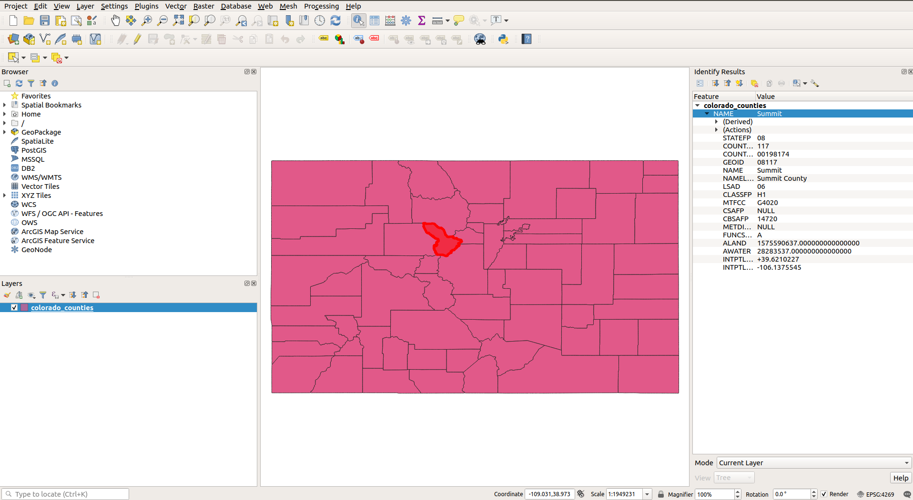
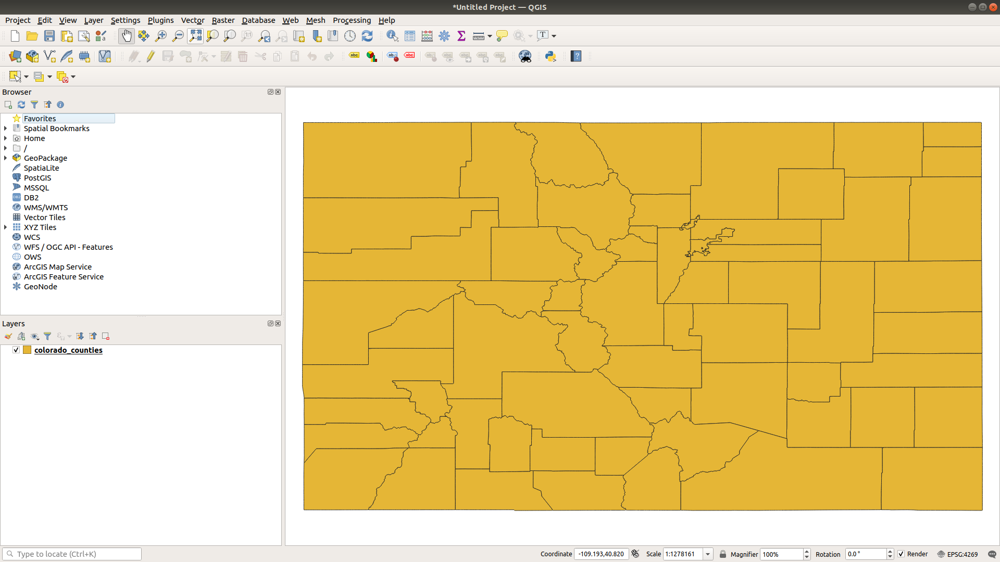

```{r setup, include=FALSE}
options(htmltools.dir.version = FALSE)
options(tigris_use_cache = TRUE)
library(tigris)
library(tmap)
tmap_options(legend.text.size = 1)

knitr::opts_chunk$set(message = FALSE, warning = FALSE, fig.width = 12)
```

```{r xaringan-themer, include=FALSE, warning=FALSE}
library(xaringanthemer)

style_xaringan(
  title_slide_background_color = "#035004",
  text_color = "black",
  header_color = "#035004",
  inverse_background_color = "#035004",
  text_font_family = "Gotham Narrow",
  header_font_family = "Helvetica",
  header_font_weight = "bold",
  link_color = "#1a730f",
  code_inline_color = "#035004"
)
```

## About me

* Associate Professor of Geography at TCU 

* Spatial data science researcher and consultant

* R package developer: tidycensus, tigris, mapboxapi

* Book coming this year: _Analyzing the US Census with R_
  - These workshops are a sneak preview of the book's content!

---

## SSDAN workshop series

* Today: spatial analysis and mapping in R

* Last Thursday (March 4): an introduction to analyzing US Census data with tidycensus ([code](https://github.com/walkerke/umich-workshop/blob/main/census-data-in-r/code/part-1-code.R) | [video recording](https://www.youtube.com/watch?v=PnFJfuJ83NI))

* Thursday, March 25: working with US Census microdata (PUMS) with R and tidycensus

---

## Today's agenda

* Hour 1: An introduction to Census geometries and the tigris package

* Hour 2: Mapping Census data in R

* Hour 3: Spatial analysis of Census data with the sf package

---
class: middle, center, inverse

## Part 1: An introduction to Census geometries and the tigris package

---

## US Census Geography


.footnote[Source: [US Census Bureau](https://www2.census.gov/geo/pdfs/reference/geodiagram.pdf)]

---

## Census TIGER/Line shapefiles

.pull-left[


]

.pull-right[

* TIGER: Topologically Integrated Geographic Encoding and Referencing database

* High-quality series of geographic datasets released by the US Census Bureau

* Distributed as _shapefiles_, a common GIS data format comprised of several related files

]

.footnote[Image source: [US Census Bureau](https://www2.census.gov/geo/pdfs/maps-data/data/tiger/tgrshp2020/TGRSHP2020_TechDoc.pdf)]
---

## A typical GIS workflow



---

## The __tigris__ R package

.pull-left[

]

.pull-right[

* R interface to the US Census Bureau's TIGER/Line shapefile FTP server

* No API key necessary - just install the package and start using Census shapefiles in R!

]

---

## Basic usage of tigris

* To use tigris, call a function that corresponds to the Census geography you want, optionally by `state` or `county`, when appropriate

```{r basic-usage}
or_counties <- counties(state = "OR")

or_counties
```
---

```{r basic-plot}
plot(or_counties$geometry)
```

---

## The __sf__ package and simple feature geometry

.pull-left[


]

.pull-right[

* The sf package implements a _simple features data model_ for vector spatial data in R

* Vector geometries: _points_, _lines_, and _polygons_ stored in a list-column of a data frame

* Allows for tidy spatial data analysis (coming in hour 3!)

]

---

## Datasets available in tigris

* __Legal entities__: units that have legal significance in the US (e.g. states, counties)

* __Statistical entities__: units that are used to tabulate Census data but do not have legal standing (e.g. Census tracts or block groups)

* __Geographic features__: other geographic datasets provided by the Census Bureau that are not used for demographic tabulation (e.g. roads, water)

---

## Example: statistical entities

```{r benton-tracts}
benton_tracts <- tracts(state = "OR", county = "Benton")

plot(benton_tracts$geometry)
```

---

## Example: geographic features

```{r benton-roads}
benton_roads <- roads(state = "OR", county = "Benton")

plot(benton_roads$geometry)
```

---

## Example: geographic features

```{r dc-landmarks}
dc_landmarks <- landmarks("DC", type = "point")

plot(dc_landmarks$geometry)
```


---

## How tigris works

When you call a tigris function, it does the following: 

* _Downloads_ your data from the US Census Bureau website; 

* _Stores_ your data in a temporary directory by default; 

* _Loads_ your data into R as a simple features object using `sf::st_read()`

* Recommended option: use `options(tigris_use_cache = TRUE)` to cache downloaded shapefiles and prevent having to re-download every time you use them

---
class: middle, center, inverse

## tigris features and options

---

## Cartographic boundary shapefiles

.pull-left[
* Question I've received over the years: "Why does Michigan look so weird?"

* The core TIGER/Line shapefiles include _water area_ that belongs to US states and counties

]

.pull-right[
```{r michigan-tiger}
mi_counties <- counties("MI")

plot(mi_counties$geometry)
```
]


---

## Cartographic boundary shapefiles


.pull-left[
* Use the argument `cb = TRUE` to obtain a _cartographic boundary shapefile_ pre-clipped to the US shoreline

* For some geographies, highly generalized (1:5 million and 1:20 million) shapefiles are available with the `resolution` argument
]

.pull-right[
```{r michigan-cb}
mi_counties_cb <- counties("MI", cb = TRUE)

plot(mi_counties_cb$geometry)
```
]

---

## Understanding yearly differences in TIGER/Line files

* Whereas legal entities change shape very rarely (but they do change!), statistical entities change with every decennial Census

* tigris fetches Census shapefiles from 1990 up through 2020

```{r get-yearly-data}
tarrant90 <- tracts("TX", "Tarrant", cb = TRUE, year = 1990)
tarrant00 <- tracts("TX", "Tarrant", cb = TRUE, year = 2000)
tarrant10 <- tracts("TX", "Tarrant", cb = TRUE, year = 2010)
# Cartographic boundary files not yet released for 2020
tarrant20 <- tracts("TX", "Tarrant", year = 2020)

```
---

```{r plot-yearly-data}
par(mfrow = c(2, 2))

plot(tarrant90$geometry, main = "1990")
plot(tarrant00$geometry, main = "2000")
plot(tarrant10$geometry, main = "2010")
plot(tarrant20$geometry, main = "2020")


```

---

## Interactive viewing of data with __mapview__

* The mapview package brings interactive spatial data viewing to R:

```{r mapview, eval = FALSE}
library(mapview)

mapview(tarrant20)
```

* As an extension, use the leafsync package to interactively compare two or more maps

```{r sync, eval = FALSE}
library(leafsync)

sync(mapview(tarrant90), mapview(tarrant20))

```

---

## Combining spatial datasets

* The `map_*()` family of functions in the tidyverse's purrr package allows for iteration over values/datasets, which works well for assembly of regional or national objects

```{r combine-bgs}
library(tidyverse)

state_codes <- c(state.abb, "DC")

us_bgs <- map_df(state_codes, ~block_groups(state = .x, cb = TRUE))

glimpse(us_bgs)
```
---

## US Census shapefiles and coordinate reference systems

* _Coordinate reference system_ (CRS): how coordinates in your spatial data are referenced to the Earth's surface

* Distinction: _geographic coordinate systems_ (longitude/latitude) and _projected coordinate systems_ (planar, commonly measured in meters or US feet)

* CRS used by Census shapefiles: North American Datum of 1983 (EPSG code 4269)

---

```{r check-crs}
library(sf)

fl_counties <- counties("FL", cb = TRUE)

st_crs(fl_counties)
```
---

## Choosing a coordinate reference system

* __crsuggest__ my _developmental_ R package for helping choose the right coordinate system transformation

* To install: `remotes::install_github("walkerke/crsuggest")`

* Two core functions: `suggest_crs()` for a table of CRS recommendations; `suggest_top_crs()` for a quick best match


---

## Choosing a coordinate reference system

```{r suggest-crs}
library(crsuggest)

fl_crs <- suggest_crs(fl_counties)

glimpse(fl_crs)
```

---

## CRS transformations

* Use the `st_transform()` function in the sf package to perform coordinate reference system transformations with the appropriate EPSG code

```{r transform-crs}
fl_projected <- st_transform(fl_counties, crs = 3086)

head(fl_projected)
```

---

## Part 1 exercises

* Give tigris a try for yourselves!  [Explore the available geographies in the tigris documentation](https://github.com/walkerke/tigris) and fetch data for a state and/or county of your choosing.  Plot the result with `plot()` or with `mapview()`.  

---
class: middle, center, inverse

## Part 2: Mapping US Census data in R

---

## Typical Census GIS workflows

Traditionally, getting "spatial" Census data requires: 

--

* Fetching shapefiles from the Census website;

--

* Downloading a CSV of data, cleaning/formatting it;

--

* Loading geometries and data into your GIS of choice;

--

* Aligning key fields in your GIS and joining your data

---

## Geometry in tidycensus

* tidycensus takes care of this entire process with the argument `geometry = TRUE`

```{r tidycensus-geometry}
library(tidycensus)
options(tigris_use_cache = TRUE)

dc_income <- get_acs(geography = "tract", 
                     variables = c(hhincome = "B19013_001"), 
                     state = "DC", 
                     geometry = TRUE)

```

---

```{r show-geometry}
dc_income
```

---

## Basic mapping with base plotting

```{r plot-geometry}
plot(dc_income["estimate"])
```

---

## Basic mapping with ggplot2

* `geom_sf()`: ggplot2 method to use simple features in your data visualization workflows

```{r geom-sf}
library(tidyverse)

dc_map <- ggplot(dc_income, aes(fill = estimate)) + 
  geom_sf()
```

---

```{r plot-geom-sf}
dc_map
```

---
class: middle, center, inverse

## Mapping Census data with tmap

---

## The tmap package

.pull-left[


]

.pull-right[

* Comprehensive package for thematic mapping in R

* ggplot2-like syntax, but designed in a way to feel friendly to GIS cartographers coming to R for mapping

]

---

## Example data

* Our example: comparing the distributions of racial and ethnic groups in Hennepin County, Minnesota (Minneapolis)

```{r get-hennepin-data}
hennepin_race <- get_acs(
  geography = "tract",
  state = "MN",
  county = "Hennepin",
  variables = c(White = "B03002_003",
                Black = "B03002_004",
                Native = "B03002_005",
                Asian = "B03002_006",
                Hispanic = "B03002_012"),
  summary_var = "B03002_001",
  geometry = TRUE
) %>%
  mutate(percent = 100 * (estimate / summary_est))
```

---

```{r glimpse-hennepin-data}
glimpse(hennepin_race)
```
---

## Basic plotting with tmap

.pull-left[

* `tm_shape()` initializes the shape; `tm_polygons()` shows the polygons for quick display

```{r polygons-code, eval = FALSE}
library(tmap)

hennepin_black <- filter(hennepin_race, 
                         variable == "Black")

tm_shape(hennepin_black) + 
  tm_polygons() 
```

]

.pull-right[

```{r polygons-map, echo = FALSE}
library(tmap)

hennepin_black <- filter(hennepin_race, 
                         variable == "Black")

tm_shape(hennepin_black) + 
  tm_polygons() 
```

]


---

## Choropleth mapping with tmap

.pull-left[

* _Choropleth maps_ show statistical variation through color or shading of areas

* They generally should be used with _normalized data_ such as rates or percentages, not counts

```{r choropleth-code, eval = FALSE}
tm_shape(hennepin_black) + 
  tm_polygons(col = "percent")
```

]

.pull-right[

```{r choropleth-show, echo = FALSE}
tm_shape(hennepin_black) + 
  tm_polygons(col = "percent")
```

]


---

## Modifying choropleth options

* Color palettes can be modified with the `palette` parameter, which accepts ColorBrewer and viridis palettes

* If you've mapped with GIS software before, the `style` parameter implements various breaks methods, including `"equal"`, `"quantile"` and `"jenks"`

---

.pull-left[

```{r custom-choropleth-code, eval = FALSE}
tm_shape(hennepin_black, 
         projection = sf::st_crs(26915)) + 
  tm_polygons(col = "percent",
          style = "quantile",
          n = 7,
          palette = "Purples",
          title = "ACS estimate") + 
  tm_layout(title = "Percent Black\nby Census tract",
            frame = FALSE,
            legend.outside = TRUE)
```

]

.pull-right[

```{r custom-choropleth-show, echo = FALSE}
tm_shape(hennepin_black, 
         projection = sf::st_crs(26915)) + 
  tm_polygons(col = "percent",
          style = "quantile",
          n = 7,
          palette = "Purples",
          title = "ACS estimate") + 
  tm_layout(title = "Percent Black\nby Census tract",
            frame = FALSE,
            legend.outside = TRUE)
```

]


---

## tmap choropleth tips and tricks

* Use `tmaptools::palette_explorer()` to interactively browse color options

* Use the option `tm_layout(legend.hist = TRUE)` to display the distribution of data values among classes

---

.pull-left[

```{r jenks-code, eval = FALSE}
tm_shape(hennepin_black, 
         projection = sf::st_crs(26915)) + 
  tm_polygons(col = "percent",
          style = "jenks",
          n = 7,
          palette = "viridis",
          title = "ACS estimate",
          legend.hist = TRUE) + 
  tm_layout(title = "Percent Black population\nby Census tract",
            frame = FALSE,
            legend.outside = TRUE)
```

]

.pull-right[

```{r jenks-show, echo = FALSE}
tm_shape(hennepin_black, 
         projection = sf::st_crs(26915)) + 
  tm_polygons(col = "percent",
          style = "jenks",
          n = 7,
          palette = "viridis",
          title = "ACS estimate",
          legend.hist = TRUE) + 
  tm_layout(title = "Percent Black population\nby Census tract",
            frame = FALSE,
            legend.outside = TRUE)
```

]

---

## Graduated symbol maps

* Graduated symbols: using _size_ of a symbol to represent statistical variation on a map

* Implemented in tmap with `tm_bubbles()`

```{r bubbles-code}
symbol_map <- tm_shape(hennepin_black) + 
  tm_polygons() + 
  tm_bubbles(size = "estimate", alpha = 0.5, 
             col = "navy")
```

---

```{r bubbles-map}
symbol_map
```

---

## Faceted mapping

* `tm_facets()` allows for comparative small multiples maps.  It works well with long-form spatial data returned by tidycensus

```{r facet-map-code}
facet_map <- tm_shape(hennepin_race,
         projection = sf::st_crs(26915)) + 
  tm_facets(by = "variable", scale.factor = 4) + 
  tm_fill(col = "percent",
          style = "quantile",
          n = 7,
          palette = "Blues")
```

---

```{r facet-map}
facet_map
```

---

## Advanced example: dot-density mapping

.pull-left[

* Dot-density maps scatter dots relative to data values, and are good for showing within-polygon diversity

* To generate points for dot-density mapping, points should be proportionally sampled in polygons relative to data values then randomized with `slice_sample()`

]

.pull-right[

```{r generate-dots, echo = TRUE, eval = FALSE}
groups <- unique(hennepin_race$variable)

hennepin_dots <- map_df(groups, ~{
  hennepin_race %>%
    filter(variable == .x) %>%
    st_transform(26915) %>%
    mutate(est50 = as.integer(estimate / 50)) %>%
    st_sample(size = .$est50, exact = TRUE) %>%
    st_sf() %>%
    mutate(group = .x)
}) %>%
  slice_sample(prop = 1)
```

]


---

```{r plot-dots, eval = FALSE}
tm_shape(hennepin_dots) +
  tm_dots(col = "group", palette = "Set1", size = 0.005)
```


---

## Mapping the entire US with `shift_geo`

* The `shift_geo` parameter uses Bob Rudis's [albersusa geometries](https://github.com/hrbrmstr/albersusa) to shift and re-scale Alaska and Hawaii for thematic mapping

```{r shift-geo}
us_median_age <- get_acs(geography = "state",
                         variables = "B01002_001",
                         year = 2019,
                         survey = "acs1",
                         geometry = TRUE,
                         shift_geo = TRUE)
```
---

```{r show-shift-geo, fig.width = 8}
tm_shape(us_median_age) + tm_polygons()
```

---

```{r style-shift-geo, fig.width = 10}
tm_shape(us_median_age) + 
  tm_polygons(col = "estimate", palette = "RdPu", title = "Median age") + 
  tm_layout(legend.outside = TRUE)
```

---

## Interactive mapping

* For quick interactive mapping, use the `zcol` parameter in `mapview()` or `tmap_mode("view")` in tmap

* For customizable interactive mapping, check out the leaflet package and its integration with the Shiny framework for data dashboards

```{r, eval = FALSE}
library(mapview)

mapview(dc_income, zcol = "estimate")
```

---

## What if I still want to use a GIS?

* No problem! Write out your data to a shapefile/GeoJSON/GeoPackage with `sf::st_write()` and load into your GIS of choice

* Recommendation: use `output = "wide"` for multi-variable datasets (easier to use in a desktop GIS)

```{r write-shp, eval = FALSE}
library(sf)

st_write(dc_income, "data/dc_income.shp")
```


---

## Part 2 exercises

Try making your own map with tmap!  

* If you are just getting started with tidycensus/the tidyverse, make a race/ethnicity map by adapting the code provided in this section but for a different county.  

* If you are comfortable with tidycensus at this stage, pick a different variable to map instead!

---
class: middle, center, inverse

## Spatial analysis of US Census data with the sf package

---

## Spatial analysis in a GIS

.pull-left[

Some typical terminology for spatial analysis in a desktop GIS context: 

* Select by Attributes

* Select by Location

* Spatial Join

* Geoprocessing (Clip, Dissolve, Union, etc.)

]

.pull-right[



]

---

## sf: a tidy data model for spatial analysis

* sf's data model is designed for integration within tidyverse data wrangling workflows

* Many tidyverse methods (including those presented last week) work on sf objects

* Geometries are "sticky" and not lost after performing data wrangling operations

* The `st_*()` family of functions help you complete many common GIS tasks

---

## Topic: COVID-19 vaccinations in Texas

* Of interest: how do COVID-19 vaccination rates vary geographically in Texas?

* The most granular geography available is the zip code, which we approximate with the Zip Code Tabulation Area (ZCTA)

* Data should be normalized by population given wide variations in ZCTA populations

---

## Data setup

* [Up-to-date vaccination data available from the Texas Department of State Health Services](https://dshs.texas.gov/coronavirus/AdditionalData.aspx); I've cleaned up the Excel spreadsheet for us

```{r get-vax-data}
library(tidyverse)

tx_vaccinations <- read_rds("spatial-analysis/data/tx_vaccinations.rds")

glimpse(tx_vaccinations)
```

---

## Data setup

.pull-left[

* Given that vaccines are only administered to patients age 16 and up, we can acquire appropriate normalization data from the ACS Data Profile

```{r get-pop-normalization}
library(tidycensus)
options(tigris_use_cache = TRUE)

pop16up <- get_acs(
  geography = "zcta",
  variables = "DP03_0001",
  geometry = TRUE,
  state = "TX"
)
```

]

.pull-right[

```{r map-normalization-pop}
library(tmap)

tm_shape(pop16up) + tm_fill(col = "estimate")
```
]

---

## "Joining" geometries and attributes

* dplyr's `*_join()` family of functions help analysts merge tabular data to sf objects

```{r calculate-rates}
tx_vacc_rate <- pop16up %>%
  left_join(tx_vaccinations, by = c("GEOID" = "zip_code")) %>%
  mutate(pct_vaccinated = 100 * (total_vaccinations / estimate)) %>%
  mutate(pct_vaccinated = ifelse(pct_vaccinated > 100, NA, pct_vaccinated))
```

---

```{r map-rates}
tm_shape(tx_vacc_rate) + tm_fill(col = "pct_vaccinated", palette = "Reds")
```

---

## Selecting data by attributes

* dplyr's `filter()` works on spatial data and allows for targeted visualization by attribute values

```{r dallas-area}
dallas_area <- tx_vacc_rate %>%
  filter(str_sub(GEOID, 1, 2) == "75")

above_40 <- dallas_area %>%
  filter(pct_vaccinated >= 40)
```

---

```{r above-40}
tm_shape(dallas_area) + tm_polygons() + 
  tm_shape(above_40) + tm_polygons(col = "navy") 
```

---
class: middle, center, inverse

## Spatial overlay

---

## Spatial overlay

* Common question: how do local characteristics vary within and between metropolitan areas?

* Methods: _spatial filtering_ ("select by location" in a GIS context) and _spatial joins_

* tigris geometries work well for a wide range of Census overlays

```{r dfw-metro}
dfw_metro <- core_based_statistical_areas(cb = TRUE) %>%
  filter(str_detect(NAME, "Dallas"))
```

---

## Spatial filters

* The sf package implements spatial filters using both base R notation and the tidyverse-style `st_filter()` function

For example, 

```{r spatial-subset}
library(sf)

dfw_zips <- tx_vacc_rate[dfw_metro, ]
```

is equivalent to: 

```{r spatial-filter}
dfw_zips <- st_filter(tx_vacc_rate, dfw_metro)
```

---

```{r plot-filter}
tm_shape(dfw_zips) + 
  tm_polygons(col = "pct_vaccinated", palette = "Reds") + 
  tm_layout(legend.outside = TRUE)
```

---

## Spatial predicates

* The default _spatial predicate_, `st_intersects()`, defines the spatial relationship as any overlap between the two layers

* Many other spatial predicates are available ([see the sf documentation for more examples](https://r-spatial.github.io/sf/reference/geos_binary_pred.html))

* Example: ZCTAs that fall entirely within the Dallas-Fort Worth metro boundary (do not cross the border)

```{r get-within}
dfw_zips_within <- st_filter(tx_vacc_rate, dfw_metro, .predicate = st_within)
```

---

```{r plot-within}
tm_shape(dfw_zips_within) + 
  tm_polygons(col = "pct_vaccinated", palette = "Reds") + 
  tm_layout(legend.outside = TRUE)
```

---

## Spatial joins

.pull-left[

* Spatial joins transfer attributes from one spatial dataset to another based on shared spatial relationships

* Like spatial filters, spatial joins rely on spatial predicates to determine spatial relationships between features

* Implemented in the sf package with `st_join()`

]

.pull-right[

```{r join-metros}
tx_metros <- core_based_statistical_areas(cb = TRUE) %>%
  filter(GEOID %in% c("19100", "26420", "41700", "12420")) %>%
  select(metro_name = NAME)

zips_by_metro <- tx_vacc_rate %>%
  st_join(tx_metros, left = FALSE)
```
]

---

```{r glimpse-zips-by-metro}
glimpse(zips_by_metro)
```
---

## Comparative visualization

```{r compare-metros-code, eval = FALSE}
ggplot(zips_by_metro) + 
  geom_density(aes(x = pct_vaccinated), color = "navy", fill = "navy", 
               alpha = 0.4) + 
  theme_minimal() + 
  facet_wrap(~metro_name) + 
  labs(title = "Percent of population age 16+ vaccinated for COVID-19",
       subtitle = "ZCTAs, largest metropolitan areas in Texas",
       y = "Kernel density estimate",
       x = "Percent receiving at least one vaccine dose")

```

---


---
class: middle, center, inverse

## Advanced application: spatial clustering and group-wise spatial data analysis

---

## The spdep package

.pull-left[

* spdep: the workhorse R package for both exploratory spatial data analysis and spatial modeling

* Key concept: _spatial neighbors_

* spdep helps model spatial relationships for clustering analysis, spatial lags & smoothing, and spatially-aware modeling

]

.pull-right[


]

---

## Data setup

* Research question: can we identify contiguous "regions" in Wayne County, Michigan by age, income, and education?

```{r skater-data-setup}
input_tracts <- get_acs(
  geography = "tract",
  variables = c(median_age = "B01002_001",
                median_income = "B19013_001",
                pct_college = "DP02_0068P"),
  state = "MI",
  county = "Wayne",
  geometry = TRUE,
  output = "wide"
) %>%
  select(-ends_with("M")) %>%
  na.omit()
```
---

## The SKATER algorithm

.pull-left[

* General concept: unsupervised clustering with spatial constraints

* SKATER: Spatial "Kluster" Analysis by Tree Edge Removal

* Uses minimum spanning trees to minimize within-group dissimilarity while ensuring that groups are spatially contiguous

]

.pull-right[

```{r setup-skater}
library(spdep)

input_vars <- input_tracts %>%
  select(median_ageE:pct_collegeE) %>%
  st_drop_geometry() %>%
  scale() %>%
  as.data.frame()

nb <- poly2nb(input_tracts)
costs <- nbcosts(nb, input_vars)
weights <- nb2listw(nb, costs, style = "B")
```

]

---

## Regionalization with SKATER

```{r run-skater}
mst <- mstree(weights)

regions <- skater(mst[,1:2], input_vars, ncuts = 6)

input_tracts$group <- as.character(regions$group)
```

---

```{r plot-groups}
tm_shape(input_tracts) + tm_polygons("group", palette = "Set1")
```

---

## Group-wise operations on spatial data

* dplyr's `group_by()` and `summarize()`, used together on a spatial object, implements an analogous operation to a _Dissolve_ in a GIS

```{r summarize-regions}
wayne_regions <- input_tracts %>%
  group_by(group) %>%
  summarize(across(.cols = where(is.numeric),
                   .fns = mean))
```

---

```{r wayne-regions-map, fig.width = 10}
tm_shape(wayne_regions) + tm_polygons(col = "group", palette = "Set1")
```

---

```{r wayne-regions}
wayne_regions
```

---

## Part 3 exercises

Try putting together a spatial analysis workflow yourself!  Acquire data on median household income by Census tract for Texas: 

```{r}
texas_income <- get_acs(
  geography = "tract",
  variables = "B19013_001",
  state = "TX",
  geometry = TRUE
)
```

Answer the following: 

* How does median household income vary geographically in the Austin metropolitan area?  Show this on a map.  

* How does the distribution of median household incomes by Census tract vary among the four largest metro areas in Texas?  

---
class: middle, center, inverse

## Thank you!


